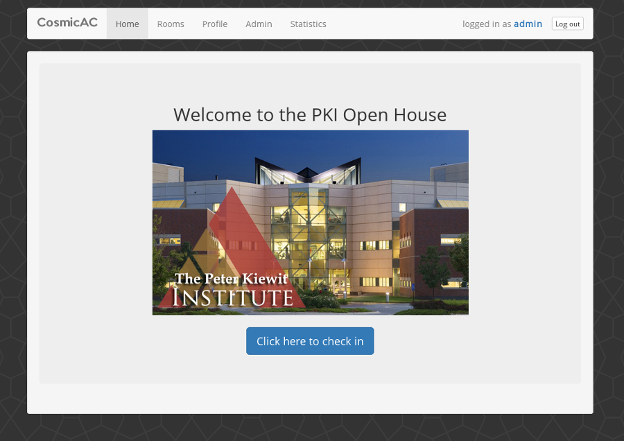

# CosmicAC
Web application for guiding prospective students through the PKI open house.



## setup
```bash
# Install virtualenv (https://virtualenv.pypa.io/en/latest/installation.html)
pip install virtualenv
virtualenv --no-site-packages -p /usr/bin/python2 env
# If you're on a mac, try just: virtualenv --no-site-packages env
source env/bin/activate
pip install -r requirements.txt
# to set up database:
python setup.py
```

## To start server
```bash
python cosmicac.py

or

gunicorn cosmicac:app
```
